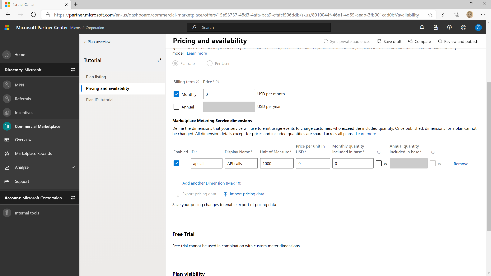
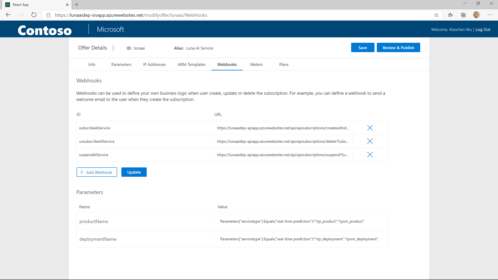

# Publish an SaaS offer

In this article, we will show you how to publish the AI service we created in the previous steps as an Azure SaaS offer in Azure Marketplace.

## (Optional) Publish an SaaS offer in Azure Marketplace

To test the fully end to end user experience, you need to publish an SaaS offer in Azure Marketplace. This requires you become a Microsoft Partner first, and get all marketing and legal documents ready. If you are not ready to create and publish your offer in Azure Marketplace yet, you can skip this step for now. Later we will also show you how to test the SaaS offer without being published in Azure Marketplace.

You can follow [this instruction](https://docs.microsoft.com/en-us/azure/marketplace/partner-center-portal/create-new-saas-offer) to create and publish your SaaS offer in Azure Marketplace. To connect your Azure Marketplace SaaS offer with Luna service, you need to:

- Choose "yes" for "Would you like to sell through Microsoft?" in the offer setup
- In "Technical configuration" use the information the deployment script printed out when you were deploying Luna service.

To use your offer for this tutorial, you need to:

- Create a private plan.
- Set $0 monthly flat rate so you don't really get billed for your test.
- Add your orgnization's tenant id to the Restricted Audience list of your private plan.
- Configure [meter based billing](https://docs.microsoft.com/en-us/azure/marketplace/partner-center-portal/saas-metered-billing) for your private plan. In this tutorial, we will assume you billing your user $0 per 1000 API calls.

  

## Create and configure an offer in Luna management portal

If you specified SaaS offer name when creating the AI service, the SaaS offer will be automatically created and configured. You can simply go to SaaS offers tab in the management portal to find your SaaS offer. 

To create a new SaaS offer in Luna, you can login to the Luna management portal (where you published the AI service earlier), go to the "Offers" tab and click on "New Offer". You need to provide the following info:

- ID: the offer id. If you created an SaaS offer in Azure Marketplace, you will need to use the same offer id
- Alias: a friendly name for your offer
- Version: the version of your offer.
- Owners: put your AAD id here
- Host Subscription: Luna allows you deploy and manage Azure resources when end user create, update or delete their subscription. We won't use this feature in our tutorial, so you can put any GUID in this field. If you are going to explore and use this feature later, you can alway come back and update your subscription id.


Then click on Save. It will bring you to the offer configuration wizard.

### Add offer parameters

The offer parameters allow you to collect additional information from your customer when they creating the SaaS offer subscription. In this tutorial, we are going to add 3 offer parameters:

- Service type: let user choose either they want to subscibe the real-time prediction service or train their own model
  - parameter Id: servicetype
  - Displace Name: Service Type
  - Description: Choose which type of service you want to subcribe
  - Value Type: String
  - From List: checked
  - Value List: real-time prediction;train your own model
- Email: ask user to provide their email address
  - parameter Id: email
  - Displace Name: Email
  - Description: Your email address
  - Value Type: String
  - From List: unchecked
- Receive Product Update: ask user whether they want to get email about your product update
  - parameter Id: productupdate
  - Displace Name: Receive Product Update Email?
  - Description: Choose whether you want to receive product update email from us
  - Value Type: Boolean


### Create webhooks to connect your SaaS offer with the AI services

In Luna service, you can define webhooks and calling those webhooks when user create, update or delete their subscriptions. We will use this function to connect your SaaS offer with the AI services you created in the previous steps.

In the [previous step](./publish-ai-service.md#save-the-luna-webhook-url), we saved 3 webhook URLs from the "Product" tab of Luna management portal. If you don't have those webhook URLs yet, go to the "Product" panel and copy it.

When you are defining webhooks in Luna service, you can pass in more information to your webhook using query parameters. There are two types of parameters: system parameter and user defined parameters.

If you want to refer to a system parameter, for example, subscription id, you can use system$$parameter_name. If you want to create your own parameters, just use any name without '$'. In the subscribe webhook, we are going to use the following parameters:

- ProductName: productName
- DeploymentName: deploymentName
- UserId: system$$subscriptionOwner
- SubscriptionName: system$$subscriptionId
- SubscriptionId: system$$subscriptionId

Once you added these query parameters to the URL it should look like:

```http
https://uniqueName-apiapp.azurewebsites.net/api/apisubscriptions/createwithid?ProductName={productName}&DeploymentName={deploymentName}&UserId={system$$subscriptionOwner}&SubscriptionName={system$$subscriptionId}&SubscriptionId={system$$subscriptionId}
```

Update the other two webhook URL too:

The unsubscribe URL

```http
https://uniqueName-apiapp.azurewebsites.net/api/apisubscriptions/delete?SubscriptionId={system$$subscriptionId}
```

The suspend URL

```http
https://uniqueName-apiapp.azurewebsites.net/api/apisubscriptions/suspend?SubscriptionId={system$$subscriptionId}
```

Then on the webhook panel of the offer configuration wizard, click on "Add Webhook" to add a new webhook, name it as "subscribeAIService" and paste the subscribe URL in "URL" field. Also create the "unsubscribeAIService" and "suspendAIService" webhooks using the corresponding URLs.

After the webhooks are created, you will find 2 user defined parameters automatically extracted from the URLs and shown in the "parameters" table below. In Luna service, you can define the parameter values using C# expression. In this example, we will define the product name and deployment name according to the user picked service type. Add the following values to the "Value" field in the "Parameters" table:

ProductName:

```C#
Parameters["servicetype"].Equals("real-time prediction")?"rtp_product":"tyom_product"
```

DeploymentName:

```C#
Parameters["servicetype"].Equals("real-time prediction")?"rtp_deployment":"tyom_deployment"
```



Then click on the "Save" button on the upper right corner to save the changes.

### Create and configure a plan

The last step of publishing a SaaS offer is to create a plan. Go to the Plans tab in the offer configuraiton wizard, click on "Add Plan" button.

- In the popped up window, fill in the plan name which should be the same with the plan id you used when creating the private plan in Microsoft Partner Center.
- Then select the webhook for corresponding operations.
- Click on "Save" button to save the changes.


Now you have your SaaS offer and plan published in Luna service.

## Next step

[Test SaaS offer](./test-saas-offer.md)
