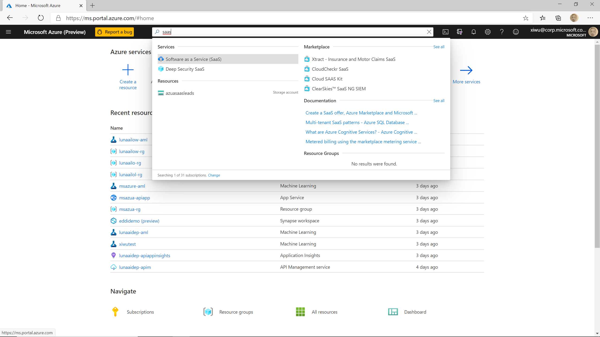
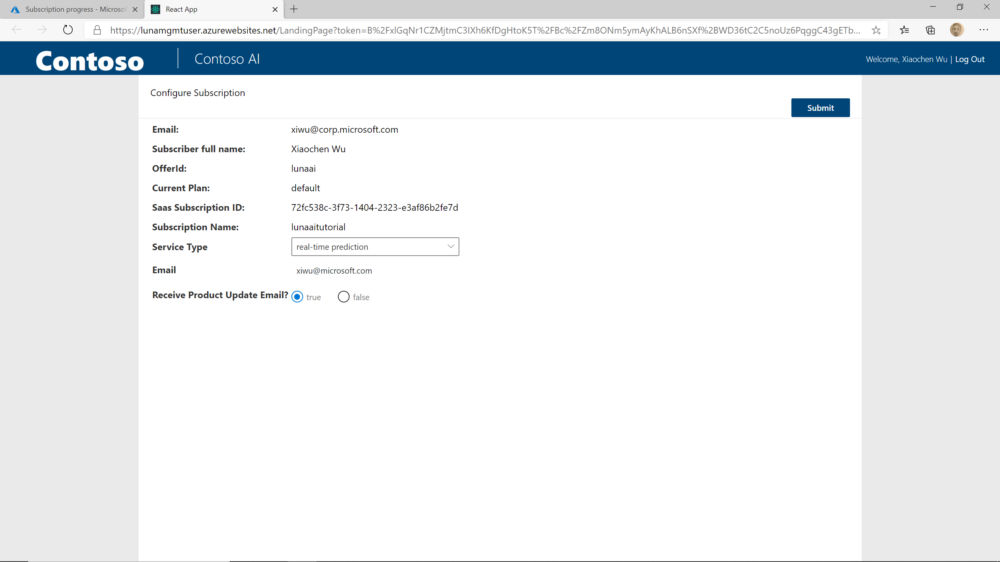
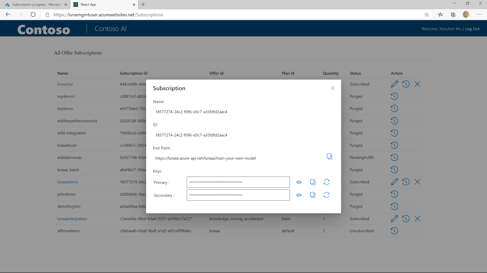

# Test the SaaS offer

In this article, we will show you how to test the SaaS offer with and without a published Azure Marketplace SaaS offer.

## Test with a published Azure Marketplace SaaS offer

If you have your Azure Marketplace SaaS offer published in the preview steps (TODO: add link). You can subscribe the SaaS offer from Azure portal.

Login into the [Azure Portal](https://portal.azure.com). Type SaaS in the search text box and choose "Software as a Service (SaaS)".

Click on the "Add" button on the upper left corner. It will bring you to the Azure Marketplace.

If you published offer with a public plan, you can search for your offer name in the search text box. If you published a private plan and whitelisted your organization's tenant id, click on the "View private offers" link on the "You have private offers available" banner to view all the private offers.

Once you find the SaaS offer you published, click on the tile. It will open the offer details page. Select the private plan you created for this tutorial and click on the "Set up + subscribe" button.

On the next page, give the subscription a name, choose the Azure subscription, and click on "Subscribe" button.

The subscription operation usaully taks 20 seconds to a minute, after the subscription completed, click on the "Configure SaaS account on publish's site". It will bring you to the landing page which is deployed and configured as a part of Luna service.

On the landing page, you will see all 3 offer parameters we created [when configuring SaaS offer in Luna management portal](./publish-saas-offer.md#add-offer-parameters).

Choose the AI service you want to test, fill in rest of the fields and click on "Submit" button. It will bring you to the user subscription management page where you can see all your subscriptions.

In the backend, Luna service started a state machine running all the provisioning steps as you configured, including calling the webhook to subscribe the AI service. The state machine runs every minute to move to the next state. it will take 3 to 5 minutes to finish the provisioning.

After the provisioning is completed (you need to refresh the page to see the changes), you should see a hyperlink on the subcription name. Click on the hyperlink, it will open a modal with the AI service base url and the subscription key.

Now you can use either the [Postman collection or the python notebook we used to test the AI service](./test-ai-service.md) to continue the test.

## Test without a published Azure Marketplace SaaS offer

Publishing a SaaS offer in Azure Marketplace requires some marketing and legal materials. We understand that could take long or collabaration with other department in your organization. Here we are going to show you how can you test the SaaS offer using REST API.

### Get AAD token
The easiest way to get a valid AAD token is to retreving that from a API call from your management portal
- Log in to your management portal
- Open Developer Tools in your broswer (F12 for Edge)
- Go to Network
- Click on any tab in your management portal
- Find the GET call and find the Authorization header. 
- Copy the token. You will only need the part after "Bearer ".

### Test Azure Marketplace SaaS offer using REST API
You can then test the Azure Marketplace SaaS offer using the Postman collection.
- Download the Postman collection form [here](https://www.getpostman.com/collections/58bf0dae770ca1fc1f20)
- Right click on the collection and select Edit
- In the Authorization tab, update the token you obtained in the previous step. Remember you only need the part after "Bearer "
- In the Variables tab, update the variables. If you are running the test multiple times, you need to use a new subscription-id every time you run it.
- Run the PUT request to create a subscription
- Run the GET request to get the subscription. The create subscription request will trigger a state machine processing the request. This process will take a few minutes. Eventually, the "provisioningStatus" in the returned payload should be "NotificationFailed". Since you don't have the Azure Marketplace offer created yet, this is expected.
- You can also find the base URL and keys to test your AI service.

## Next Step

[Deploy a hotfix](./deploy-a-hotfix.md)
