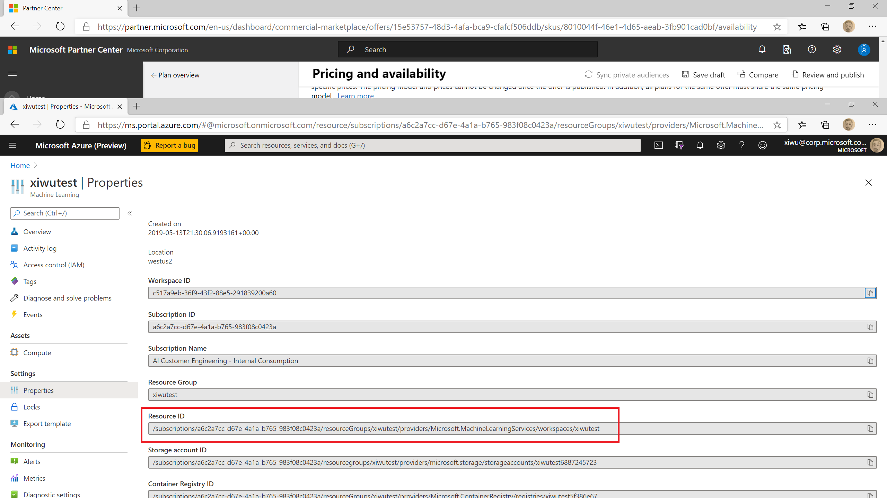

# Create a ML project using Luna.AI project template

In this article, we will show you how to create and config a ML project using Luna.AI project template

## Create the project using Luna.AI project template

You can find the Luna.AI project template [here](https://github.com/Azure/LunaAIProjectTemplate).

### If you are creating a new repo using GitHub

Simply click the "Use this template" button and create a new GitHub repo using the template

### If you are using the template on an existing repo, using other Git product or not using any Git product

Clone the repo or download the code by clicking the "Code" button and merge it into your Git repo.

## Config the project before using it

The Luna.AI project template is designed in the way that data scientists can write platform-free machine learning code and later run it in Azure Machine Learning Services or MLflow servers (not supported yet). Before using this template, you need to change a few configure values:

- In *.cloud/.azureml/test_workspace.json", 
    - update value of "Scope" to the resource Id of your Azure Machine Learning service. You can find the resource Id in the "Settings/Properties" blade of the Azure Machine Learning service in Azure portal.
    - update value of "AmlCompute" to the name of compute cluster you created in your Azure Machine Learning service. If you are using the Azure Machine Learning service created when deploying Luna service, the default compute cluster name is *lunaamlcompute*. If you are using your own Azure Machine Learning workspace, see [here](https://docs.microsoft.com/en-us/azure/machine-learning/how-to-set-up-training-targets#portal-create) for how to create a compute cluster.
    - update value of "DeploymentTarget" to "aks" for deploying to Azure Kubernetes Service or "aci" to deploying to Azure Container Instance. If "aks" is specified, update value of "AksCluster" to the name of AKS cluster you created in Azure Machine Learning service. In this tutorial, we will use Azure Container Instance. If you want to continue with AKS as the deployment target, see [here](https://docs.microsoft.com/en-us/azure/machine-learning/how-to-deploy-azure-kubernetes-service#create-a-new-aks-cluster) about how to create and attach an AKS cluster in Azure Machine Learning workspace

## Next Step

[Add your code to the ML project](./add-ml-code.md)
